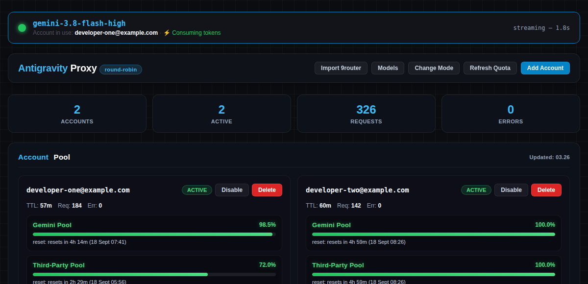

# Antigravity Multi-Account Proxy v2.3.2


OpenAI-compatible reverse proxy that aggregates multiple Google Antigravity accounts into a single load-balanced endpoint with automatic rate-limit failover, quota tracking, session authentication, multi-API key support, and built-in token optimization plugins.



---

## What's New in v2.3.2
- **Turn Sanitization Guard:** Automatically sanitizes trailing assistant/model turns in incoming conversation history to prevent HTTP 400 `Requests ending with a model turn are not supported` from interrupting multi-turn workflows.

---

---

## Supported Models

| Model Name (OpenAI Format) | Upstream Antigravity Target | Thinking Configuration |
|---|---|---|
| `gemini-3.8-flash-high` | `gemini-3.8-flash-tiered` | `thinkingLevel: high` |
| `gemini-3.8-flash-medium` | `gemini-3.8-flash-tiered` | `thinkingLevel: medium` |
| `gemini-3.7-flash-high` | `gemini-3.7-flash-tiered` | `thinkingLevel: high` |
| `gemini-3.6-flash-high` | `gemini-3.6-flash-high` | `thinkingBudget: 24576` |
| `gemini-3.1-pro-high` | `gemini-pro-agent` | `thinkingBudget: 24576` |
| `claude-sonnet-4-6-thinking` | `claude-sonnet-4-6` | Thinking enabled |
| `claude-opus-4-6-thinking` | `claude-opus-4-6-thinking` | Thinking enabled |

---

## Optimization Plugins

Control plugins dynamically via dashboard or `config.json`:
```json
{
  "optimizers": {
    "rtk": true,
    "caveman": false,
    "ponytail": true
  }
}
```

### 1. RTK (Reduced Tool Kit)
- **Problem:** Terminal outputs from `npm install`, `cargo build`, or test suites often dump thousands of lines into the conversation context.
- **Solution:** RTK retains the initial command context and the recent exit tail while compressing the noisy middle, reducing 1,000+ tokens to under 20 tokens.

### 2. Caveman Mode
- **Problem:** LLMs often add unnecessary conversational padding ("I would be delighted to assist you with your request...").
- **Solution:** Enforces direct, high-density technical answers, drastically saving completion token spend and accelerating stream generation.

### 3. Ponytail Mode
- **Problem:** Coding assistants frequently rewrite an entire file from scratch when only modifying a minor variable or function call.
- **Solution:** Enforces targeted diffs and surgical patches, preserving context space for larger multi-file coding sessions.

### Per-Request Optimizer Override
Clients can override global settings dynamically per request:
```bash
# Option A: via JSON payload parameter
curl http://localhost:20130/v1/chat/completions \
  -H "Authorization: Bearer <key>" \
  -H "Content-Type: application/json" \
  -d '{
    "model": "gemini-3.8-flash-high",
    "messages": [{"role": "user", "content": "Explain Spring Boot architecture in depth"}],
    "optimizers": {"caveman": false}
  }'

# Option B: via HTTP Header
curl http://localhost:20130/v1/chat/completions \
  -H "Authorization: Bearer <key>" \
  -H "X-Optimizer-Caveman: false" \
  -H "Content-Type: application/json" \
  -d '{
    "model": "gemini-3.8-flash-high",
    "messages": [{"role": "user", "content": "Analyze system performance"}]
  }'
```

---

## Account Setup & Import Methods

There are 3 standard ways to add accounts:

### Method 1: Import from 9router (Automatic or Manual)
- Automatic Scan:
  Click "Import 9router" in the web dashboard navigation bar. The server automatically scans default SQLite database locations (`~/.9router/db/data.sqlite` or `/app/data/db/data.sqlite`).
- Manual Input:
  If custom database paths are used, copy your SQLite path from 9router Settings > Local Mode and paste it into the prompt. The path is saved automatically.

### Method 2: OAuth 2.0 Web Authorization
Authenticate accounts directly via your browser by clicking "Add Account via OAuth" in the web UI.

### Method 3: Manual Refresh Token Entry
Add refresh tokens directly via the "Add Account" modal in the dashboard or append them to the `accounts` array in `config.json`.

---

## License

MIT License (c) 2026 Julian Efendi
